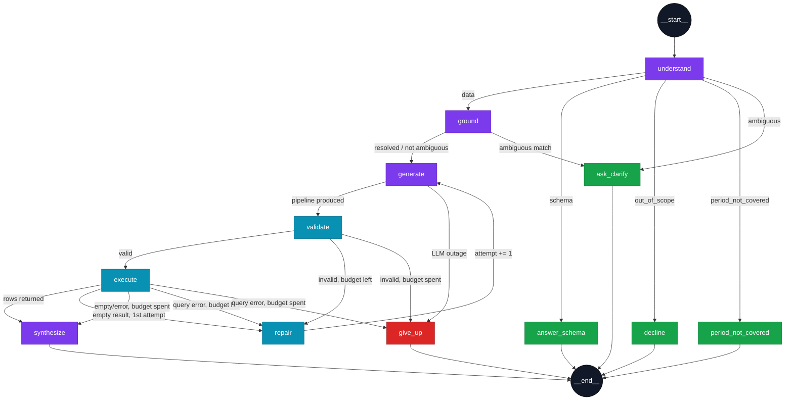

# The Agent

A LangGraph state machine of 12 nodes. This document walks it node by node,
with the actual routing logic, so a reader can predict what the graph does for
any given input without running it.

Source: `backend/app/agent/`. Contract this implements:
[`specs/001-procurement-chat-assistant/contracts/agent-state.md`](../specs/001-procurement-chat-assistant/contracts/agent-state.md).

## Graph shape



*Purple = calls the model. Cyan = deterministic, no model call (`validate` is
the constitution's guard; `execute` is Mongo; `repair` just increments a
counter). Green = terminal answer nodes that never query anything. Red =
the one failure terminal.*

<details>
<summary>Plain-text version (if your viewer doesn't render Mermaid)</summary>

```
                                    ┌──────────────┐
                              ┌────▶│ answer_schema│──▶ END
                              │     └──────────────┘
                    ┌─────────┤
                    │schema   │     ┌──────────────┐
   ┌────────────┐   │out_of_  ├────▶│   decline    │──▶ END
   │ understand │───▶│ scope   │     └──────────────┘
   └────────────┘   │period_  │
                    │not_cov. ├────▶┌──────────────────┐
                    │         │     │period_not_covered│──▶ END
                    │ambiguous│     └──────────────────┘
                    │         │
                    │  data   ├────▶┌──────────────┐
                    └─────────┘     │ask_clarify   │──▶ END  (also reached
                         │          └──────────────┘         from `ground` on
                         ▼                ▲                  an ambiguous match)
                    ┌──────────┐          │ ambiguous
                    │  ground  │──────────┘
                    └──────────┘
                         │ resolved / not-ambiguous
                         ▼
                    ┌──────────┐  outage   ┌──────────┐
              ┌────▶│ generate │──────────▶│ give_up  │──▶ END
              │     └──────────┘           └──────────┘
              │          │                      ▲
              │          ▼                      │
              │     ┌──────────┐  budget spent   │
              │     │ validate │─────────────────┤
              │     └──────────┘                 │
              │          │ valid                 │
              │          ▼                       │
              │     ┌──────────┐  budget spent    │
              │     │ execute  │──────────────────┤
              │     └──────────┘                  │
              │          │ rows (or empty,        │
              │          │ 1st attempt)           │
              │  repair  │                        │
              └──────────┘                        │
                         │ rows                    │
                         ▼                          │
                    ┌───────────┐                   │
                    │synthesize │──▶ END             │
                    └───────────┘                    │
```

</details>

Built in `app/agent/graph.py:build_graph()`. Every routing decision is one of
five small functions, each independently testable:

| Function | Decides |
|---|---|
| `_route_intent` | Which of `ground` / `answer_schema` / `decline` / `period_not_covered` / `ask_clarify` follows `understand` |
| `_after_grounding` | `generate` vs `ask_clarify`, based on whether grounding found an ambiguous name |
| `_after_generate` | `validate` vs `give_up` — an LLM outage skips validation entirely |
| `_after_validate` | `execute` / `repair` / `give_up` |
| `_after_execute` | `synthesize` / `repair` / `give_up` |

### Nodes by role

The same 12 nodes, grouped by what they touch — useful for answering "does
this call the model," "does this touch the database," or "can this node ever
produce a figure" at a glance:

```
Agent graph (12 nodes)
│
├─ Entry
│   └─ understand ................... rewrites follow-ups, classifies intent [model]
│
├─ Data path (the "normal" route through the graph)
│   ├─ ground ........................ resolves named entities [in-memory + on-demand Mongo]
│   ├─ generate ....................... question → pipeline [model]
│   ├─ validate ....................... allow-list check, no model call [pure Python]
│   ├─ execute ........................ runs the pipeline [MongoDB, read-only]
│   └─ repair ......................... attempt += 1, loops back to generate [pure Python]
│
├─ Terminal — answers without ever querying Mongo
│   ├─ answer_schema .................. describes the dataset from the schema card
│   ├─ decline ........................ fixed FR-005 response, off-topic questions
│   ├─ period_not_covered ............. names the actual covered date range
│   └─ ask_clarify .................... surfaces the clarification question from `ground`
│
├─ Terminal — success
│   └─ synthesize ..................... rows + question → prose. Never sees the schema,
│                                        vocabulary, or history — see "synthesize" below
│
└─ Terminal — failure
    └─ give_up ........................ repair budget or deadline spent; never invents
                                         a figure, distinguishes an outage from a bad query
```

Every arrow in the graph above ends at one of the five terminal nodes — there
is no path through the graph that doesn't reach `synthesize`, `give_up`, or
one of the four schema/decline/clarify responders. That completeness is what
Invariant 5 in [contracts/agent-state.md](../specs/001-procurement-chat-assistant/contracts/agent-state.md)
requires: every terminal path produces either an answer or an error, never
silence.

## State

`app/agent/state.py` — a single `TypedDict`, `AgentState`, carried through every
node. Two fields are worth calling out because they're easy to confuse:

- **`messages`**: `Annotated[list[Any], add_messages]` — LangGraph's built-in
  reducer. This is what the `MemorySaver` checkpointer persists per
  `thread_id` (the session id). Because `add_messages` *appends*, this field
  is never fed back in as input; it's an outward-facing log LangGraph
  maintains for you.
- **`history`**: a plain `list[dict[str, str]]`, populated once per call by
  `routes.py` from the session store (`sessions.history(session_id)[:-1]`).
  This is what `understand` actually reads. It exists as a separate field
  precisely because re-feeding `messages` into itself each turn would
  duplicate every prior turn — see
  [`docs/decisions-and-bugs.md`](decisions-and-bugs.md#history-rendered-empty-langchain-message-objects-not-dicts).

`deadline_at` is a **monotonic** timestamp (`time.monotonic() + deadline_s`),
set once in `new_state()`. Monotonic, not wall-clock, so a system clock
adjustment mid-request can't extend or shrink the budget.

## Node by node

### `understand` (`nodes/understand.py`)

Inputs: `question`, `history`. Outputs: `resolved_question`, `intent`,
`entity_matches` (with `named` entities and a `period`, if any).

One model call (`llm.complete_json`, `max_tokens=250`) against
`UNDERSTAND_SYSTEM` (`app/agent/prompts/__init__.py`), which asks for:

```json
{
  "resolved_question": "...",
  "intent": "data | schema | out_of_scope | ambiguous",
  "entities": {"department_name": "...", "acquisition_type": "..."},
  "period": {"start": "...", "end": "..."} | null
}
```

The prompt carries worked examples for follow-up rewriting — a prior question
plus "What about Q2?" → the fully-restated version — because this is the
single highest-leverage place for the model to get multi-turn conversation
right. See [`docs/decisions-and-bugs.md`](decisions-and-bugs.md#follow-ups-losing-the-calendar-frame)
for the case that motivated adding them.

**`intent` can be overridden here.** If the model reports `data` but also
names a `period` that falls entirely outside `[DATA_COVERAGE_START,
DATA_COVERAGE_END]` (`_period_is_covered`), the node promotes the intent to
`period_not_covered` — so the graph answers "that's outside what I have" (FR-015)
instead of asking Mongo a question it can only ever answer with zero rows.

**Degrades gracefully on model outage**: if the call raises `LLMUnavailable`,
`understand` does *not* propagate the error. It returns the literal question
verbatim with `intent=DATA` and empty entities, and lets the graph continue —
on the theory that answering the question as typed, with no follow-up
resolution, beats failing the turn outright over a transient hiccup this
early. (Contrast with `generate`, where an outage *does* short-circuit
straight to `give_up` — see below.)

### `ground` (`nodes/ground.py`)

Inputs: `entity_matches.named`. Outputs: `entity_matches.resolved`,
`entity_matches.unresolved`, and — on an ambiguous match — `intent=AMBIGUOUS`
plus a `clarification` payload.

For each named entity, resolves through `app/agent/vocabulary.py`:

- `department_name`, `acquisition_type`, `acquisition_method`,
  `sub_acquisition_type`, `fiscal_year`, `creation_quarter_label` — matched
  against an **in-memory cache** loaded at startup (`vocabulary.resolve`).
- `supplier_name`, `item_name` (aliased to `item_name_normalized`) — matched
  **on demand** via `vocabulary.resolve_on_demand`, an indexed regex prefix
  scan followed by scoring only the shortlist. These fields are too
  high-cardinality (24,732 suppliers, >80,000 item names) to hold in memory.

Three outcomes per entity:

| `MatchKind` | What happens |
|---|---|
| `EXACT` / `SINGLE` | Value substituted into `entity_matches.resolved[field]`, verbatim |
| `AMBIGUOUS` | Added to a list; the *first* ambiguous field wins the clarification question (`_clarification_question`) |
| `NONE` | Kept as `unresolved` text — **not dropped** — so `generate` still includes the filter and the query returns honestly empty rather than silently ignoring a name the data doesn't contain |

If anything came back ambiguous, `ground` sets `intent=AMBIGUOUS`, and
`_after_grounding` sends the state to `ask_clarify` instead of `generate`.

See [`docs/decisions-and-bugs.md`](decisions-and-bugs.md#entity-grounding-scoring-on-filler-tokens)
for why matching is a two-score process (`_distinctive` filter-stripped score
to decide who's a candidate at all, then the full `WRatio` to rank survivors)
rather than one.

### `generate` (`nodes/generate.py`, function `generate_pipeline`)

Inputs: `resolved_question`, `entity_matches`, `validation_errors` (from a
prior failed attempt, if any). Outputs: `pipeline`, `explanation`,
`expected_shape`, `collection`.

One model call against `GENERATOR_SYSTEM`, which embeds:

- **The schema card** (`render_schema()`) — generated by
  `data_pipeline/profile.py`, not hand-written. Carries the grain warning
  ("each document is ONE LINE ITEM..."), every field with its type and
  description, verbatim enum vocabularies, and conventions (money is net of
  credits, calendar vs. fiscal quarters, IT-category values are
  `acquisition_type` not `item_name`).
- **10 few-shot examples** (`FEW_SHOT` / `render_examples()`), the first two
  deliberately contrasting counting orders (`$group` on
  `purchase_order_number`, then `$count`) against counting line items (a bare
  `$count`) — the single most consequential distinction in the whole schema.

On a repair attempt, `_user_prompt` appends the previous (rejected) pipeline
verbatim plus every validation error, so the model is fixing a specific,
named mistake rather than guessing again from scratch.

**An LLM outage here is terminal, not retryable.** `generate_pipeline`
catches `LLMUnavailable` and sets `error.code = "llm_unavailable"`.
`_after_generate` checks for exactly that and routes straight to `give_up`,
skipping `validate` entirely — see
[`docs/decisions-and-bugs.md`](decisions-and-bugs.md#provider-outage-treated-as-a-repairable-query-error)
for the incident this fixed (a 402 was burning all 3 repair attempts before
this existed).

### `validate` (`nodes/generate.py`, function `validate`)

Inputs: `pipeline`, `collection`. Outputs: `pipeline` (possibly bounded),
`validation_errors`.

A thin wrapper around `app/agent/guards.py::validate_pipeline` — see
[The validator](#the-validator) below. **No model call in this node.**

### `execute` (`nodes/execute.py`)

Inputs: `pipeline`. Outputs: `rows`, `row_count`, `truncated`, `elapsed_ms`.

```python
cursor = await get_collection().aggregate(pipeline, maxTimeMS=15000, allowDiskUse=True)
rows = [_serialize(row) async for row in cursor]
```

The `await` before `.aggregate(...)` matters: PyMongo's `AsyncMongoClient`
returns a coroutine that itself resolves to the cursor, so `aggregate()` must
be awaited *before* iterating — see
[`docs/decisions-and-bugs.md`](decisions-and-bugs.md#async-aggregate-never-awaited)
for the outage this caused when it was missed.

`_serialize` makes rows JSON-safe: a `null`-keyed group (`_id: None`, i.e. a
total-across-everything aggregation) becomes `_id: "total"`; datetimes become
ISO strings.

`truncated = row_count >= settings.max_result_rows` (200) — the synthesizer
uses this to warn the model, and the frontend uses it to show a "Showing N of
M" note.

A `PyMongoError` or `ExecutionTimeout` here does **not** raise past the node —
it's turned into a `validation_errors` entry, which routes to `repair` (or
`give_up` if the budget is spent), exactly like a rejected pipeline.

### `repair` (`nodes/execute.py`, functions `repair` / `should_repair`)

`repair` does exactly one thing: `attempt += 1`. All budget logic lives in
`should_repair`, called from both `_after_validate` and `_after_execute`:

```python
def should_repair(state: AgentState) -> bool:
    if not state.get("validation_errors"):
        return False
    if state.get("attempt", 0) >= settings.max_repair_attempts:  # 3
        return False
    return not deadline_exceeded(state)
```

Centralizing this in one function is deliberate — the constitution requires
the retry budget to live in exactly one place, so the 3-attempt ceiling and
the deadline check can never drift out of sync between the two call sites.

`_after_execute` has one more rule beyond `should_repair`: an **empty** result
(zero rows, no error) is allowed **one** repair — on the theory that an
over-narrow filter is a plausible generation mistake worth one retry — but
only on `attempt == 0`. After that, or if the deadline has already passed,
emptiness is reported as the finding it may well be (FR-007), not retried
forever.

### `synthesize` (`nodes/respond.py`)

Inputs: `rows`, `row_count`, `truncated`, `resolved_question`,
`entity_matches.resolved`. Outputs: `answer`, `chart_spec`.

**This is the node where Principle III ("grounded answers only") is enforced
as a property of its inputs**, not an instruction: `synthesize` is never
handed the schema card, the vocabulary, or prior turns' data — only the
literal rows this specific query returned and the question. There is nothing
in scope for the model to invent a figure *from*.

Zero rows short-circuits before any model call (`_empty_answer`) — the
constitution's reasoning being that a model handed an empty table is exactly
where invention happens, so the safest place to prevent it is to never ask.

When the result is truncated, or when more rows exist than fit in the prompt
(`MAX_ROWS_IN_PROMPT = 60`), the prompt says so explicitly — including the
literal instruction *"do not combine these into a total"*. This exists
because of a real, observed failure: see
[`docs/decisions-and-bugs.md`](decisions-and-bugs.md#the-synthesizer-inventing-a-total-from-a-partial-row-slice).
`SYNTHESIZER_SYSTEM` itself additionally forbids calculation outright — every
figure in the answer "must be COPIED" from a row, never summed, averaged, or
rounded by the model.

`_chart_spec` decides whether to attach a chart: only when
`expected_shape ∈ {category_measure, time_series}` and at least 2 rows came
back, picking `_id` (or the first key) as `x_field` and the first numeric
non-`x_field` key as `y_field`. A scalar result never gets a `chart_spec`
(FR-022).

### Terminal answer nodes (`nodes/respond.py`)

Four more nodes never touch the database:

- **`answer_schema`** — describes the dataset (document count, coverage,
  distinct orders, acquisition types) from the schema card, for
  "what does this data cover?"-style questions.
- **`decline`** — the fixed FR-005 response for anything not about
  procurement.
- **`period_not_covered`** — names the actual covered range
  (`2012-07-01`–`2015-06-30`, from `DATA_COVERAGE_START`/`END`) rather than
  silently returning nothing.
- **`ask_clarify`** — surfaces the `clarification` payload `ground` built, or
  a generic "could you rephrase" if the ambiguity has no specific candidates
  attached.

And one failure node:

- **`give_up`** — reached when the repair budget or the deadline is spent.
  Distinguishes two causes in its answer text and in `error.code`:
  `llm_unavailable` ("I couldn't reach the language model... a service
  problem on my side, not a problem with your question") versus
  `validation_failed` ("I couldn't build a valid query... try rephrasing").
  Never produces a figure.

## The validator

`app/agent/guards.py` — pure Python, no imports of `httpx`/`requests`/`openai`
(asserted directly by `test_guards.py::TestNoNetworkAccess`), no
configuration a prompt could reach. This is the concrete form of constitution
Principle II.

**Allow-list, not deny-list** (`ALLOWED_STAGES`): `$match`, `$group`, `$sort`,
`$limit`, `$skip`, `$project`, `$addFields`, `$set`, `$count`, `$unwind`,
`$bucket`, `$bucketAuto`, `$facet`, `$sortByCount`, `$sample`,
`$replaceRoot`. Anything else — including a stage MongoDB adds in some future
version — is rejected by default, not permitted because nobody updated a
deny-list.

`FORBIDDEN_STAGES` is a second, explicit list (`$out`, `$merge`, `$where`,
`$function`, `$accumulator`, `$graphLookup`, `$lookup`, `$unionWith`,
`$currentOp`, `$listSessions`, `$listLocalSessions`, `$planCacheStats`,
`$collStats`, `$indexStats`) — deliberately redundant with the allow-list, so
a reader can see exactly what's being defended against and a test can assert
the documented set is covered.

`FORBIDDEN_OPERATORS` catches the same code-executing/collection-escaping
operators **wherever they appear**, including nested inside an otherwise
permitted stage's expression — `_walk_for_forbidden_operators` recurses
through arbitrary dict/list structure, so `{"$match": {"$where": "..."}}` is
caught even though `$match` itself is allowed. `_validate_stages` additionally
recurses into `$facet` sub-pipelines (up to depth 3), so a forbidden stage
hidden inside a `$facet` branch is still rejected — the case a top-level-only
check would wave through.

**Field-reference checking tracks what each stage actually makes available**,
not just the original collection schema (`_stage_outputs` /
`_validate_field_references`). This exists because a naive "every field must
be in the schema" check rejects the completely ordinary
`$group → $sort → $project` shape: after a `$group`, the only fields that
exist are `_id` and whatever accumulator names the stage defined (`spend`,
`orders`, ...) — those are computed names, not document fields. See
[`docs/decisions-and-bugs.md`](decisions-and-bugs.md#the-validator-rejecting-its-own-group-output-as-unknown-fields)
for the follow-up sequence this broke before the fix.

**Row bounding** (`_apply_row_bound`): if the pipeline's last stage is `$count`
(already scalar, no bound needed), it's left alone. Otherwise, an existing
`$limit` is clamped to `MAX_RESULT_ROWS` (200); if there's no `$limit` at all,
one is appended. This is FR-013, enforced here rather than trusted from the
prompt.

`validate_pipeline()` also pins the collection name (`target_collection`,
always `"purchase_orders"`) — a pipeline naming any other collection is
rejected outright, which is what keeps a single-collection design honest even
before the stage checks run.

## Entity grounding

`app/agent/vocabulary.py`. The docstring states the stakes plainly: *"the
largest single lever on query accuracy"* — a model asked to guess how
`"Department of Consumer Affairs"` is stored produces natural word order,
matches nothing in `"Consumer Affairs, Department of"`, and the assistant
confidently reports zero.

`match_value()` is pure (no I/O), which is what makes it directly unit-tested
against fixtures shaped like the real data
(`backend/tests/test_vocabulary.py`). The matching itself is two scores doing
two different jobs — see
[`docs/decisions-and-bugs.md`](decisions-and-bugs.md#entity-grounding-scoring-on-filler-tokens)
for the incident that made this necessary and the exact numbers involved.

Thresholds (`FUZZY_MATCH_THRESHOLD=90`, `FUZZY_AMBIGUOUS_FLOOR=75`,
`DECISIVE_MARGIN=5.0`) are configuration, not hardcoded — see
[`docs/operations.md`](operations.md#configuration-reference).

## Provider access

`app/agent/llm.py` — an `AsyncOpenAI` client pointed at
`OPENROUTER_BASE_URL`, model id read from `settings.llm_model` on every call
(never hardcoded at a call site, per the constitution's Technology
Constraints). Three entry points, one per agent need:

- `complete_json()` — requests `response_format={"type": "json_object"}`, and
  still tolerates a fenced ` ```json ` response if the provider ignores that
  (`parse_json`'s `_FENCE` regex) — a parse failure here would otherwise burn
  a repair attempt on a formatting problem rather than a real query problem.
- `complete()` — plain text, used by `synthesize`.
- `reachable()` — the `/health` liveness probe, cached 60s
  (`_PROBE_TTL_S`) so a 15-second container healthcheck doesn't bill a model
  call four times a minute forever.

Any `RateLimitError`, `APITimeoutError`, or `APIError` from the `openai` SDK
is caught and re-raised as the project's own `LLMUnavailable` — the one
exception type every node above actually checks for.
