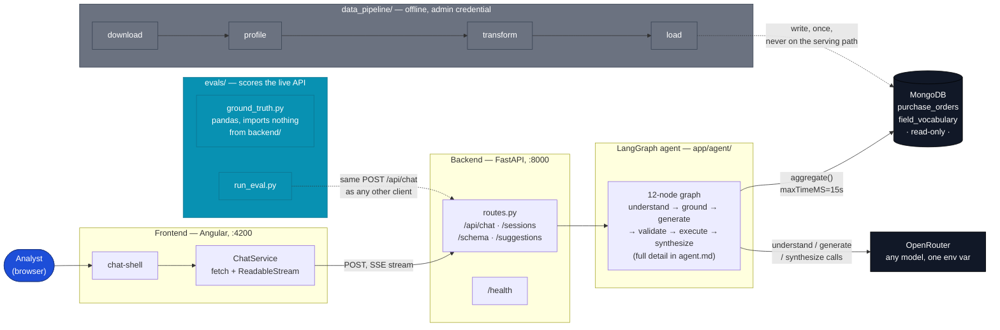

# Architecture

How the pieces fit together, and why they're split the way they are. For the
requirements this satisfies, see [`specs/001-procurement-chat-assistant/`](../specs/001-procurement-chat-assistant/);
this document describes what was actually built.

## System overview

Left to right, starting from the one node everything else hangs off of: the
analyst in the browser. Each piece downstream gets its own row.



*Solid arrows are the live request path (a question, end to end). Dashed
arrows are the two offline/out-of-band paths — loading data and scoring the
API — that never run as part of answering a question.*

<details>
<summary>Plain-text version (if your viewer doesn't render Mermaid)</summary>

```
                    ┌─────────────────────────────────────────────┐
                    │              Angular 22 (port 4200)          │
                    │  chat-shell → ChatService → result-table/    │
                    │  chart/pipeline-panel, signals-based state   │
                    └───────────────────┬───────────────────────────┘
                                        │ fetch + ReadableStream (SSE)
                                        │ dev proxy: /api → :8000
                    ┌───────────────────▼───────────────────────────┐
                    │           FastAPI backend (port 8000)         │
                    │  routes.py: /api/chat, /sessions, /schema,    │
                    │             /suggestions · /health on the app │
                    └───────────────────┬───────────────────────────┘
                                        │
                    ┌───────────────────▼───────────────────────────┐
                    │          LangGraph agent (app/agent/)         │
                    │  understand → ground → generate → validate    │
                    │       ↑___________repair__________↓           │
                    │                  → execute → synthesize        │
                    └──────┬───────────────────────────┬─────────────┘
                           │                           │
              ┌────────────▼────────────┐  ┌──────────▼──────────────┐
              │   MongoDB (read-only)    │  │  OpenRouter (any model)  │
              │   purchase_orders        │  │  understand/generate/    │
              │   field_vocabulary       │  │  synthesize each call it │
              └────────────▲────────────┘  └──────────────────────────┘
                           │
              ┌────────────┴────────────┐
              │   data_pipeline/          │   offline, never on the
              │   download → profile →    │   serving path — the admin
              │   transform → load        │   Mongo credential lives
              └───────────────────────────┘   only here
```

</details>

Four independently-runnable pieces:

| Piece | Runs as | Talks to |
|---|---|---|
| `data_pipeline/` | one-shot CLI scripts | Kaggle API, MongoDB (admin credential) |
| `backend/` | FastAPI + uvicorn | MongoDB (read-only), OpenRouter |
| `frontend/` | Angular dev server / static build | `backend/` only, via `/api` |
| `evals/` | CLI scripts | `backend/`'s HTTP API only |

## Why they're separated this way

**`data_pipeline/` is not part of `backend/`.** It is the only code in the
project that holds write access to MongoDB, and it runs once, offline, before
the server ever starts. Keeping it a separate package means there is no import
path by which the serving process could reach a write-capable credential —
the separation is what makes "the backend is read-only" an architectural fact
rather than a convention someone could accidentally violate.

**`evals/` imports nothing from `backend/`.** `evals/ground_truth.py` computes
expected answers with pandas, directly from the source CSV. If it imported the
transform or agent code, a bug shared by both sides would silently cancel out
and the eval would prove nothing. The independence is enforced by import
structure, not by discipline — see [`docs/evaluation.md`](evaluation.md).

**The agent graph is a separate layer from the API.** `app/agent/graph.py`
builds and compiles a LangGraph `StateGraph` with no knowledge of HTTP, SSE, or
sessions. `app/api/routes.py` drives it with `graph.astream(...)` and turns
each node's output into wire events. This means the agent's control flow —
the repair loop, the routing between intents — is testable by calling nodes
directly (see `backend/tests/test_agent_nodes.py`), without spinning up a
server.

## Request lifecycle

A single `POST /api/chat` call, end to end:

1. **`routes._stream_answer`** ensures a session (`app/api/sessions.py`,
   in-memory, capped at 200 sessions / 100 turns each), records the user's
   turn, and builds the initial `AgentState` (`app/agent/state.py`).
2. The whole run is wrapped in `asyncio.timeout(deadline_s)` — the hard
   ceiling described in [`docs/operations.md`](operations.md#the-per-question-deadline).
3. `graph.astream(state, stream_mode="updates")` runs the compiled graph node
   by node. After every node, `routes.py`:
   - accumulates per-node wall time into `node_ms` (used in the
     `chat.answered` log line),
   - maps the node name to a user-facing `Phase` and emits a `status` event,
   - on `validate` success, emits the `pipeline` event once,
   - on `execute`, emits the `rows` event.
4. Once the graph reaches a terminal node, the accumulated `answer` is split
   into word-chunks and streamed as `token` events, followed by `chart` (if
   the shape warrants one), `done`, or `error`.
5. The assistant's turn — with its full `Derivation` (pipeline, row count,
   elapsed ms, attempts) — is recorded in the session store, so
   `GET /api/sessions/{id}/messages` can return it later.

Full node-by-node detail: [`docs/agent.md`](agent.md).
Full wire contract: [`docs/api.md`](api.md).

## Data flow, one level down

```
kaggle_data/*.csv (31 raw columns, 346,018 rows)
        │  data_pipeline/transform.py
        ▼
purchase_orders documents (40 fields: 31 mapped/typed + 3 normalized + 6 derived)
        │  data_pipeline/load.py
        ▼
MongoDB: purchase_orders (11 indexes) + field_vocabulary (6 cached fields)
        │  backend/app/db/client.py (AsyncMongoClient, read-only URI)
        ▼
agent/nodes/execute.py → aggregate(pipeline, maxTimeMS=15000, allowDiskUse=True)
```

Full field-by-field mapping and transformation rules:
[`docs/data-pipeline.md`](data-pipeline.md).

## Key structural decisions

| Decision | Why | Detail |
|---|---|---|
| PyMongo `AsyncMongoClient`, not Motor | Motor reached end of life 2026-05-14 | [`research.md` R1](../specs/001-procurement-chat-assistant/research.md) |
| Repair loop as graph edges, not `try/except` | Constitution requires the retry budget to live in one predicate (`should_repair`), not be scattered | [`docs/agent.md`](agent.md#node-by-node), `repair` section |
| Validator is pure Python, no model call | A prompt must not be able to argue its way past the allow-list | [`docs/agent.md`](agent.md#the-validator) |
| Entity grounding scores twice (distinctive + full) | One score can't both reject noise and rank survivors | [`docs/agent.md`](agent.md#entity-grounding) |
| `synthesize` sees only rows + question | Makes "no invented figures" a property of the node's inputs | [`docs/agent.md`](agent.md#node-by-node), `synthesize` section |
| Per-model eval results stored separately | Lets two models be compared instead of overwriting each other | [`docs/evaluation.md`](evaluation.md) |
| Deadline shipped at 60s against a 30s spec value | Measured provider latency varies 3–21s per call across three sequential calls | [`docs/operations.md`](operations.md#the-per-question-deadline) |

## Where to look next

- Building or debugging the agent itself → [`docs/agent.md`](agent.md)
- Reloading or changing the dataset → [`docs/data-pipeline.md`](data-pipeline.md)
- Calling the API from something other than the shipped frontend → [`docs/api.md`](api.md)
- Working on the Angular client → [`docs/frontend.md`](frontend.md)
- Running or extending the golden-set evaluation → [`docs/evaluation.md`](evaluation.md)
- Running it locally, reading logs, diagnosing a stuck request → [`docs/operations.md`](operations.md)
- "Why does the code do X" for something surprising → [`docs/decisions-and-bugs.md`](decisions-and-bugs.md)
